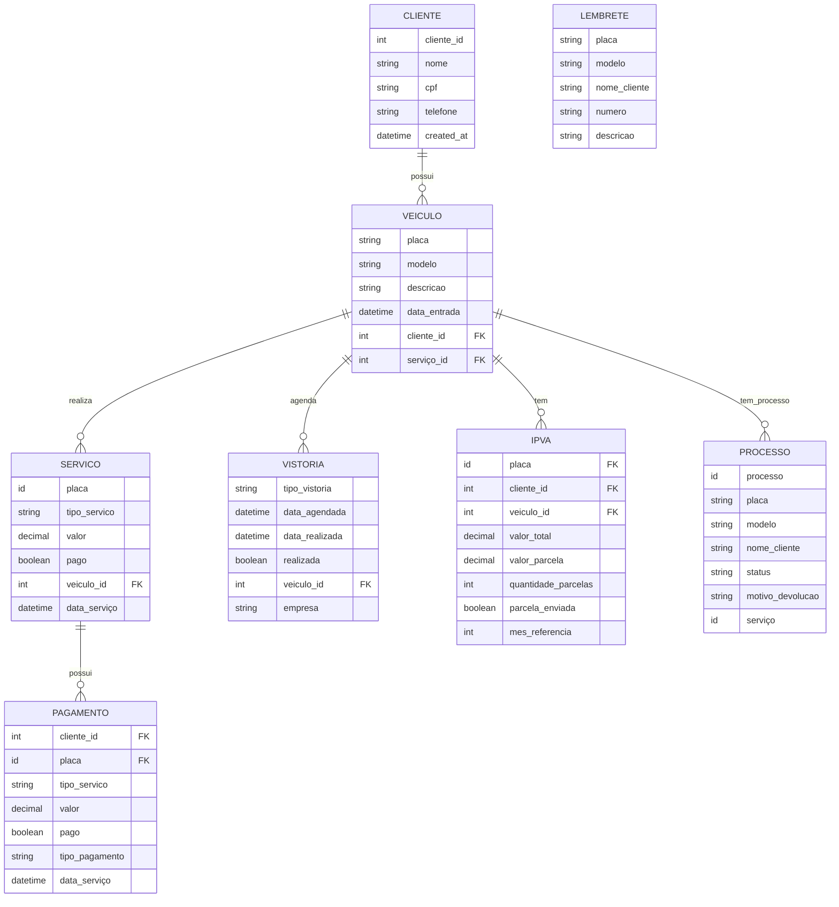
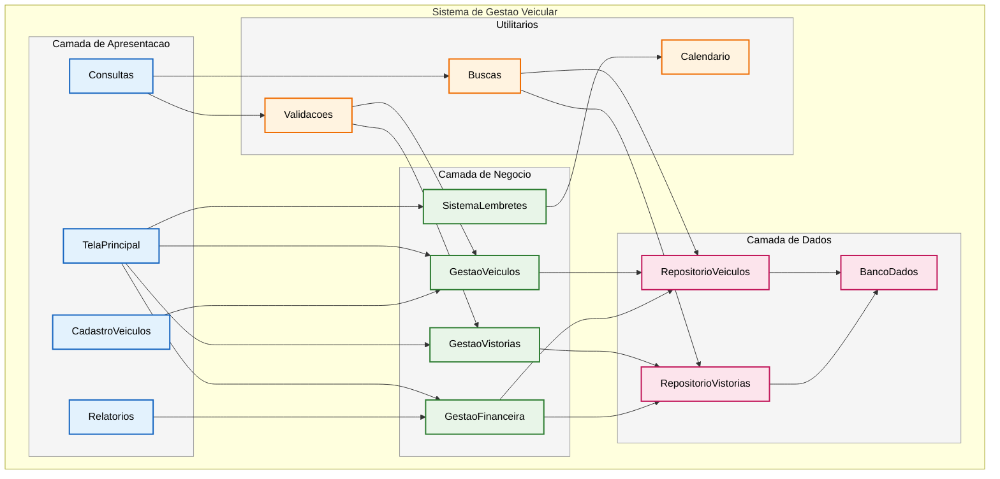

# Sistema-de-Gerenciamento

- [Sistema-de-Gerenciamento](#sistema-de-gerenciamento)
- [1. Introdução](#1-introdução)
- [2. Descrição de requisitos](#2-descrição-de-requisitos)
- [3. Diagramas](#3-diagramas)
- [3.1. Diagrama ER (entidade relacionamento)](#31-diagrama-er-entidade-relacionamento)

# 1. Introdução

  O sistema desenvolvido nesse projeto possui a finalidade de gerenciar os clientes e serviços em uma empresa despachante documentalista, isto é, empresa credenciada ao Detran ao qual facilita trâmites burocráticos relacionados a veículos, como documentação e emplacamento. Dessa forma, a solução proposta busca centralizar e automatizar atividades essenciais do cotidiano da empresa, como o acompanhamento das prioridades diárias, o monitoramento das tarefas de cada colaborador, o cadastro de clientes, serviços e formas de pagamento, bem como o registro detalhado do andamento de cada solicitação. Além disso, o sistema visa facilitar o controle de prazos e lembretes de vistorias agendadas, além de gerar relatórios mensais que auxiliem na gestão financeira. Portanto, o projeto propõe um software que contribui para a organização e produtividade da empresa, promovendo uma administração mais eficiente e um atendimento de maior qualidade aos clientes.

# 2. Descrição de requisitos

A seguir, é apresentada uma tabela que reúne os requisitos da empresa, especificando se tratam de demandas internas ou de funcionalidades executadas por meio do sistema do DETRAN.

Tabela 1. Requisitos internos da empresa e/ou que dependem do sistema do DETRAN. 

| ID | Nome da Atividade | Interna | DETRAN |
|----|--------------------|:-------:|:------:|
| 1  | A empresa emite recibo de transferência de veículos automotores e reboques do Mato Grosso| x | x |
| 2  | A empresa emite recibo de transferência de veículos automotores e reboques de outras UF para o MT | x | x |
| 3  | A empresa emite boletos de impostos de veículos automotores e reboques do Mato Grosso  | x | x |
| 4  | A empresa pode emitir uma placa mercosul decorativa | x |   |
| 5  | A empresa pode realizar o processo de transferência de um veículo de outro UF para o estado do MT | x | x |
| 6  | A empresa realiza a transferência de propriedade, município ou jurisdição de veículos automotores e reboques para o MT | x | x |
| 7  | A empresa faz o processo de primeiro emplacamento de veículos automotores e suas extensões | x | x |
| 8  | A empresa pode acompanhar o parcelamento do IPVA de um cliente e efetuar o envio do boleto mensalmente | x |   |
| 9  | A empresa pode parcelar multas e demais débitos referente a veículos automotores e reboques no cartão | x | x |
| 10 | A empresa realiza a segunda via de placa Mercosul de veículos| x | x |
| 11 | A empresa efetua a troca de placa do modelo antigo para a Mercosul | x | x |
| 12 | A empresa emite segunda via de recibo de transferência de veículos automotores e reboques | x | x |
| 13 | A empresa faz o processo de baixa definitiva de veículo | x | x |
| 14 | A empresa emite uma listagem de débitos todo fim do mês para fins de pagamento | x |  |
| 15 | A empresa pode intermediar uma venda ao encontrar o proprietário do veículo com auxilio do sistema Detran | x |   |
| 16 | A empresa transfere veículo de leilão | x | x |
| 17 | A empresa marca vistoria lacrada para veículos | x |   |
| 18 | A empresa pode marcar vistoria particular para um veículo| x |   |
| 19 | A empresa transfere veículo com inventário | x | x |
| 20 | A empresa faz o procedimento de Inclusão de gravame no documento do veículo | x | x |
| 21 | A empresa pode consultar bloqueio administrativo de um veículo | x | x |
| 22 | A empresa auxilia no processo de retirar veículo apreendido no guincho | x | x |
| 23 | A empresa auxilia no processo de retirar veículo de outra UF apreendido no guincho | x |   |
| 24 | A empresa faz comunicado de venda de um veículo | x | x |
| 25 | A empresa emite comunicado de venda de um veículo de outra UF | x |   |
| 26 | A empresa pode cancelar intenção de venda de um veículo | x | x |
| 27 | A empresa pode cancelar intenção de venda de um veículo de outra UF | x |   |
| 28 | A empresa realiza a troca de categoria de veículo | x | x |
| 29 | A empresa faz o processo de alteração de característica de veículo | x | x |
| 30 | A empresa marca vistoria pelo detran para a transferência de um veículo| x | x |
| 31 | A empresa faz o processo de recuperar veículo sinistrado | x | x |

# 2.1 Descrição de Requisitos Funcionais do Sistema 

| ID | Requisitos funcionais do sistema |
|----|-----------------------------------|
| 1 | O sistema deve permitir o cadastro do veículo com data de entrada, placa, modelo, nome, telefone, descrição, serviço e valor |
| 2 | O sistema deve registrar data de vistorias que serão ou já foram feitas pelo detran |
| 3 | O sistema deve registrar vistorias que serão ou já foram feitas por uma empresa terceirizada |
| 4 | O sistema deve colocar um lembrete de vistorias que estão próximas para fazer ou vencer |
| 5 | O sistema deve ter um campo para adicionar lembretes, o qual conterá: placa, modelo, nome do cliente, numero e uma descrição |
| 6 | O sistema deve agrupar os veículos pelo mês |
| 7 | O sistema deve gerar um relatório de serviços do mês, o qual conterá placa, modelo, serviço, valor e nome do cliente para fins financeiros |
| 8 | O sistema deve ter na tela principal uma tabela de prioridades do dia, a qual conterá informações da data de entrada, placa, modelo, nome do cliente, telefone, descrição, serviço e valor |
| 9 | O sistema deve permitir consultas por meio da placa, nome do cliente ou numero do telefone |
| 10 | O sistema deve possuir uma tabela para acompanhar os parcelamentos de IPVA dos clientes, a qual conterá o nome do cliente, numero de telefone, placa, modelo, valor do IPVA, valor da parcela e quantidade |
| 11 | A tabela de IPVA deve ter um botão para selecionar se a parcela já foi enviada para o cliente naquele mês |
| 12 | O sistema deve apresentar uma tabela de sinal público, que conterá placa, veículo, nome do cliente, numero e valor |
| 13 | O sistema deve possuir uma tabela dos processos que foram devolvidos com os campos: placa, modelo, nome do cliente e motivo |
| 14 | O sistema deve registrar a situação do pagamento do serviço | 

# 3. Diagramas

# 3.1 Diagrama Entidade-Relacionamento - Sistema de Gestão de Despachante

*mudar marcacao
## Descrição das Entidades:

### CLIENTE
- Cadastro central de clientes com nome, cpf e telefone
- Relaciona com veículos, IPVA, sinal público e processos devolvidos

### VEICULO
- Registro completo do veículo com placa, modelo e descrição
- Data de entrada para controle de tempo no sistema

### SERVICO
- Controle de serviços realizados com valores e status de pagamento
- Base para relatórios mensais financeiros

### VISTORIA
- Gestão de vistorias (DETRAN e terceirizadas)
- Controle de agendamento e realização

### IPVA
- Acompanhamento parcelamento IPVA
- Controle de envio de parcelas mensais

### Entidades Auxiliares:
- **LEMBERTE**: Controle de lembretes
- **PROCESSO**: Histórico do processos

## 3.2 Diagrama de Casos de Uso

Caso de uso 1. Cadastrar Veículo.

Ator Principal: Funcionário
Descrição: Permite o cadastro do serviço com data de entrada, veículo, placa, nome do cliente, cpf, telefone, descrição, serviço e valor.
Pré-condições: O usuário deve estar autenticado no sistema.
Fluxo Principal:
1. O ator acessa a tela de cadastro de serviços.
2. O sistema solicita os dados obrigatórios.
3. O ator preenche os campos.
4. O sistema valida e grava o registro no banco de dados.
Pós-condições: Serviço cadastrado com sucesso.

Caso de uso 2. Registrar Vistoria do Veículo.

Ator Principal: Funcionário
Descrição: Registra o veículo, placa, data do agendamento da vistoria, colocar se é particular ou pelo Detran.
Pré-condições: Veículo deve estar cadastrado.
Fluxo Principal:
1. O ator acessa a tela de vistorias.
2. O ator preenche os campos.
3. O sistema armazena as informações.
Pós-condições: Vistoria vinculada ao veículo.

OBS: OS casos de uso é dos 14 itens, prompt: plant uml

##3.3 Diagrama de Componentes 

Esse diagrama é dos componentes que formam o sistema. 

TelaPrincipal
Responsabilidade: Interface inicial do sistema.
Funcionalidades: Exibe tabela de prioridades do dia com veículos em atendimento.
Navegação para outras funcionalidades.
Requisitos Atendidos: RF8.

CadastroVeiculos
Responsabilidade: Interface para registro de veículos.
Funcionalidades: Formulário completo de cadastro de veículos.
Campos: data entrada, placa, modelo, nome, telefone, descrição, serviço, valor.
Validação básica dos dados de entrada.
Requisitos Atendidos: RF1.

Consultas
Responsabilidade: Mecanismo de busca e pesquisa.
Funcionalidades: Busca por placa do veículo, busca por nome do cliente, busca por número de telefone.
Filtros avançados de pesquisa.
Requisitos Atendidos: RF9.

Relatorios
Responsabilidade: Geração e visualização de relatórios.
Funcionalidades:Relatório mensal de serviços.
Relatório financeiro.
Exportação de dados.
Requisitos Atendidos: RF7

CAMADA DE NEGÓCIO 
GestaoVeiculos
Responsabilidade: Regras de negócio para veículos
Funcionalidades: Validação de regras de cadastro
Agrupamento de veículos por mês
Gestão de processos devolvidos
Controle de fluxo de veículos
Requisitos Atendidos: RF1, RF6, RF13

GestaoVistorias
Responsabilidade: Controle de vistorias e prazos
Funcionalidades: Registro de vistorias do DETRAN
Registro de vistorias terceirizadas
Controle de prazos e vencimentos
Histórico de vistorias
Requisitos Atendidos: RF2, RF3

SistemaLembretes
Responsabilidade: Gestão de alertas e notificações
Funcionalidades: Lembretes de vistorias próximas do vencimento
Lembretes personalizados
Sistema de notificações
Alertas proativos
Requisitos Atendidos: RF4, RF5

Gestao Financeira
Responsabilidade: Controle financeiro e monetário
Funcionalidades: Gestão de parcelamento de IPVA
Controle de sinal público
Situação de pagamentos
Relatórios financeiros
Requisitos Atendidos: RF7, RF10, RF11, RF12, RF14

Utilitários (Serviços de Apoio)
Calendario
Responsabilidade: Controle de datas e prazos
Funcionalidades: Cálculo de vencimentos
Alertas temporais
Controle de feriados

Buscas
Responsabilidade: Mecanismo de pesquisa
Funcionalidades: Indexação de dados
Buscas otimizadas
Filtros complexos

Validacoes
Responsabilidade: Validação de dados
Funcionalidades:
Validação de formatos
Regras de negócio aplicadas
Consistência de dados

 CONVENÇÕES VISUAIS
 
🔵 Azul: Componentes de apresentação (interface)
🟢 Verde: Componentes de negócio (lógica)
🔴 Rosa: Componentes de dados (persistência)
🟠 Laranja: Componentes utilitários (serviços)
⚫ Cinza: Pacotes/agrupamentos lógicos

## 4. Telas 

