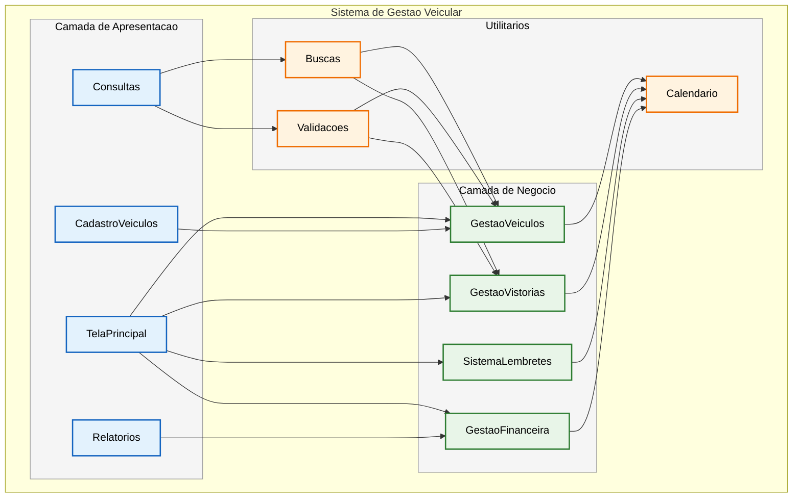

# Sistema-de-Gerenciamento

- [Sistema-de-Gerenciamento](#sistema-de-gerenciamento)
- [1. Introdução](#1-introdução)
- [2. Descrição de requisitos](#2-descrição-de-requisitos)
- [3. Diagramas](#3-diagramas)
- [3.1. Diagrama ER (entidade relacionamento)](#31-diagrama-er-entidade-relacionamento)
- [3.2 Diagrama de Casos de Uso ](#32-diagrama-de-casos-de-uso).
- [3.3 Diagrama de Componentes](#33-diagrama-de-componentes).
- [4. Telas](#4Telas).

# 1. Introdução

  O sistema desenvolvido nesse projeto possui a finalidade de gerenciar os clientes e serviços em uma empresa despachante documentalista, isto é, empresa credenciada ao Detran ao qual facilita trâmites burocráticos relacionados a veículos, como documentação e emplacamento. Dessa forma, a solução proposta busca centralizar e automatizar atividades essenciais do cotidiano da empresa, como o acompanhamento das prioridades diárias, o monitoramento das tarefas de cada colaborador, o cadastro de clientes, serviços e formas de pagamento, bem como o registro detalhado do andamento de cada solicitação. Além disso, o sistema visa facilitar o controle de prazos e lembretes de vistorias agendadas, além de gerar relatórios mensais que auxiliem na gestão financeira. Portanto, o projeto propõe um software que contribui para a organização e produtividade da empresa, promovendo uma administração mais eficiente e um atendimento de maior qualidade aos clientes.

# 2. Descrição de requisitos

A seguir, é apresentada uma tabela que reúne os requisitos da empresa, especificando se tratam de demandas internas ou de funcionalidades executadas por meio do sistema do DETRAN.

Tabela 1. Requisitos internos da empresa e/ou que dependem do sistema do DETRAN. 

| ID | Nome da Atividade | Interna | DETRAN |
|----|--------------------|:-------:|:------:|
| 1  | A empresa emite recibo de transferência de veículos automotores e reboques do Mato Grosso| x | x |
| 2  | A empresa emite recibo de transferência de veículos automotores e reboques de outras UF para o MT | x | x |
| 3  | A empresa emite boletos de impostos de veículos automotores e reboques do Mato Grosso  | x | x |
| 4  | A empresa pode emitir uma placa mercosul decorativa | x |   |
| 5  | A empresa pode realizar o processo de transferência de um veículo de outro UF para o estado do MT | x | x |
| 6  | A empresa realiza a transferência de propriedade, município ou jurisdição de veículos automotores e reboques para o MT | x | x |
| 7  | A empresa faz o processo de primeiro emplacamento de veículos automotores e suas extensões | x | x |
| 8  | A empresa pode acompanhar o parcelamento do IPVA de um cliente e efetuar o envio do boleto mensalmente | x |   |
| 9  | A empresa pode parcelar multas e demais débitos referente a veículos automotores e reboques no cartão | x | x |
| 10 | A empresa realiza a segunda via de placa Mercosul de veículos| x | x |
| 11 | A empresa efetua a troca de placa do modelo antigo para a Mercosul | x | x |
| 12 | A empresa emite segunda via de recibo de transferência de veículos automotores e reboques | x | x |
| 13 | A empresa faz o processo de baixa definitiva de veículo | x | x |
| 14 | A empresa emite uma listagem de débitos todo fim do mês para fins de pagamento | x |  |
| 15 | A empresa pode intermediar uma venda ao encontrar o proprietário do veículo com auxilio do sistema Detran | x |   |
| 16 | A empresa transfere veículo de leilão | x | x |
| 17 | A empresa marca vistoria lacrada para veículos | x |   |
| 18 | A empresa pode marcar vistoria particular para um veículo| x |   |
| 19 | A empresa transfere veículo com inventário | x | x |
| 20 | A empresa faz o procedimento de Inclusão de gravame no documento do veículo | x | x |
| 21 | A empresa pode consultar bloqueio administrativo de um veículo | x | x |
| 22 | A empresa auxilia no processo de retirar veículo apreendido no guincho | x | x |
| 23 | A empresa auxilia no processo de retirar veículo de outra UF apreendido no guincho | x |   |
| 24 | A empresa faz comunicado de venda de um veículo | x | x |
| 25 | A empresa emite comunicado de venda de um veículo de outra UF | x |   |
| 26 | A empresa pode cancelar intenção de venda de um veículo | x | x |
| 27 | A empresa pode cancelar intenção de venda de um veículo de outra UF | x |   |
| 28 | A empresa realiza a troca de categoria de veículo | x | x |
| 29 | A empresa faz o processo de alteração de característica de veículo | x | x |
| 30 | A empresa marca vistoria pelo detran para a transferência de um veículo| x | x |
| 31 | A empresa faz o processo de recuperar veículo sinistrado | x | x |

# 2.1 Descrição de Requisitos Funcionais do Sistema 

| ID | Requisitos funcionais do sistema |
|----|-----------------------------------|
| 1 | O sistema deve permitir o cadastro do veículo com data de entrada, placa, modelo, nome, telefone, descrição, serviço e valor |
| 2 | O sistema deve registrar data de vistorias que serão ou já foram feitas pelo detran |
| 3 | O sistema deve registrar vistorias que serão ou já foram feitas por uma empresa terceirizada |
| 4 | O sistema deve colocar um lembrete de vistorias que estão próximas para fazer ou vencer |
| 5 | O sistema deve ter um campo para adicionar lembretes, o qual conterá: placa, modelo, nome do cliente, numero e uma descrição |
| 6 | O sistema deve agrupar os veículos pelo mês |
| 7 | O sistema deve gerar um relatório de serviços do mês, o qual conterá placa, modelo, serviço, valor e nome do cliente para fins financeiros |
| 8 | O sistema deve ter na tela principal uma tabela de prioridades do dia, a qual conterá informações da data de entrada, placa, modelo, nome do cliente, telefone, descrição, serviço e valor |
| 9 | O sistema deve permitir consultas por meio da placa, nome do cliente ou numero do telefone |
| 10 | O sistema deve possuir uma tabela para acompanhar os parcelamentos de IPVA dos clientes, a qual conterá o nome do cliente, numero de telefone, placa, modelo, valor do IPVA, valor da parcela e quantidade |
| 11 | A tabela de IPVA deve ter um botão para selecionar se a parcela já foi enviada para o cliente naquele mês |
| 12 | O sistema deve apresentar uma tabela de sinal público, que conterá placa, veículo, nome do cliente, numero e valor |
| 13 | O sistema deve possuir uma tabela dos processos que foram devolvidos com os campos: placa, modelo, nome do cliente e motivo |
| 14 | O sistema deve registrar a situação do pagamento do serviço | 

# 3. Diagramas

# 3.1 Diagrama Entidade-Relacionamento - Sistema de Gestão de Despachante

*mudar marcacao
## Descrição das Entidades:

### CLIENTE
- Cadastro central de clientes com nome, cpf e telefone
- Relaciona com veículos, IPVA, sinal público e processos devolvidos

### VEICULO
- Registro completo do veículo com placa, modelo e descrição
- Data de entrada para controle de tempo no sistema

### SERVICO
- Controle de serviços realizados com valores e status de pagamento
- Base para relatórios mensais financeiros

### VISTORIA
- Gestão de vistorias (DETRAN e terceirizadas)
- Controle de agendamento e realização

### IPVA
- Acompanhamento parcelamento IPVA
- Controle de envio de parcelas mensais

### Entidades Auxiliares:
- **LEMBRETE**: Controle de lembretes
- **PROCESSO**: Histórico do processos

## 3.2 Diagrama de Casos de Uso

Caso de uso 1. Cadastrar Veículo.

Ator Principal: Funcionário.
Descrição: Permite o cadastro do serviço com data de entrada, veículo, placa, nome do cliente, cpf, telefone, descrição, serviço e valor.
Pré-condições: O usuário deve estar autenticado no sistema.
Fluxo Principal:
1. O ator acessa a tela de cadastro de serviços.
2. O sistema solicita os dados obrigatórios.
3. O ator preenche os campos.
4. O sistema valida e grava o registro no banco de dados.
Pós-condições: Serviço cadastrado com sucesso.

Caso de uso 2. Registrar Vistoria do Veículo.

Ator Principal: Funcionário.
Descrição: Registra o veículo, placa, data do agendamento da vistoria, colocar se é particular ou pelo Detran.
Pré-condições: Veículo deve estar cadastrado.
Fluxo Principal:
1. O ator acessa a tela de vistorias.
2. O ator preenche os campos.
3. O sistema armazena as informações.
Pós-condições: Vistoria vinculada ao veículo.

Caso de uso 3. Registrar um lembrete. 

Ator Principal: Funcionário.
Descrição: Permite criar lembretes personalizados.
Pré-condições: Sistema acessível e veículo cadastrado.
Fluxo Principal:
1. O ator acessa a área de lembretes.
2. Insere placa, modelo, nome do cliente, número e descrição.
3. O sistema salva o lembrete.
Pós-condições: Lembrete registrado.

Caso de uso 4. Gerar relatório.

Ator Principal: Gerente.
Descrição: Gera relatório mensal com placa, modelo, serviço, valor e nome do cliente.
Pré-condições: Serviços registrados.
Fluxo Principal:
1. O ator escolhe o mês.
2. O sistema compila os dados e gera o relatório.
Pós-condições: Relatório exibido ou exportado.

Caso de uso 5. Consultar Dados. 

Ator Principal: Funcionário
Descrição: Permite consultas por placa, nome, ou tipo de serviço.
Pré-condições: Registros cadastrados.
Fluxo Principal:
1. O ator digita um critério de busca.
2. O sistema retorna os resultados.
Pós-condições: Informações do veículo exibidas.

Caso de uso 6. Acompanhar parcelamento de IPVA. 

Ator Principal: Funcionário
Descrição: Mostra tabela com nome, telefone, placa, modelo, valor do IPVA, quantidade de parcelas e valor de cada uma.
Pré-condições: Clientes e veículos cadastrados.
Fluxo Principal: O ator acessa o módulo de IPVA.
Pós-condições: Tabela exibida com parcelas registradas.

Caso de uso 7. Registrar envio de parcela.

Ator Principal: Funcionário.
Descrição: Permite selecionar uma parcela de IPVA e marcar como enviada.
Pré-condições: Parcelas registradas.
Fluxo Principal:
1. O ator acessa a tabela de IPVA.
2. Seleciona a parcela.
3.Clica no botão de envio.
4. O sistema marca como “enviado”.
Pós-condições: Situação da parcela atualizada no sistema.

Caso de uso 8. Gerenciar processos devolvidos.

Ator Principal: Gerente.
Descrição: Mostra tabela de processos devolvidos com placa, modelo, cliente e motivo.
Pré-condições: cadastro do veículo no sistema.
Fluxo Principal: Ator acessa o módulo de devoluções e pode cadastrar um processo devolvido, editar, remover.
Pós-condições: Dados exibidos.

Caso de uso 9. Registrar pagamento do serviço.

Ator Principal: Financeiro. 
Descrição: Permite registrar a situação (pago, pendente, atrasado) do pagamento de serviço.
Pré-condições: Serviço cadastrado.
Fluxo Principal:
1. O ator acessa o serviço.
2. Atualiza o status de pagamento.
3. O sistema grava a alteração.
Pós-condições: Situação financeira atualizada.

Caso de uso 10. Acessar os serviços do mês.

Ator principal: Funcionário.
Descrição: Permite acessar todos os serviços daquele mês, bem como os de meses anteriores. 
Pré-condições: Serviços cadastrados.
Fluxo Principal:
1. O ator acessa o mês desejado.
2. O sistema exibe os serviços organizados por mês.
Pós-condições: Serviços exibidos.

Caso de uso 11. Cadastrar prioridades do dia. 

Ator Principal: Funcionário.
Descrição: Permite cadastrar na tela principal as prioridades que se deseja acompanhar.
Pré-condições: Sistema acessível e serviços cadastrados.
Fluxo Principal:
1. O ator acessa a tela principal.
2. Adiciona na lista de prioridades o serviço já cadastrado que se deseja priorizar. 
3. O sistema salva o cadastro.
Pós-condições: Tela inicial possui mais um cadastro de prioridades.

Caso de uso 12. Cadastrar sinal público. 

Ator Principal: Funcionário.
Descrição: Permite adicionar o serviço sinal publico a um veículo.
Pré-condições: Sistema acessível e veículo cadastrado.
Fluxo Principal:
1. O ator acessa a tela de veículos.
2. Adiciona em um veículo o serviço de sinal público. 
3. O sistema salva o cadastro.
Pós-condições: Serviço de sinal público é adicionado a um veículo.

Caso de uso 13. 

OBS: OS casos de uso é dos 14 itens, prompt: plant uml

##3.3 Diagrama de Componentes 

Esse diagrama é dos componentes que formam o sistema. 

## 4. Telas 

